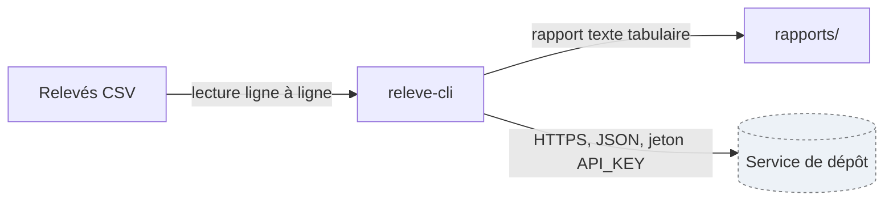

# Architecture de releve-cli

Vue d'ensemble du système, à lire avant le code. État valable au 6 octobre 2026 ; à revoir à
chaque changement de format d'entrée ou de sortie.



Le même schéma, en texte, pour les outils qui ne dessinent pas Mermaid :

```
+--------------------+  écriture du rapport   +----------------+
|  releve-cli        |  ------------------->  |  rapports/     |
|  (lecture, calcul) |  texte: nb,moy,max,min |  (fichier txt) |
+--------------------+                        +----------------+
          |
          | HTTPS, JSON : dépôt du rapport
          v
+--------------------+
|  Service de dépôt  |  <- hors périmètre du projet
+--------------------+
```

## Légende

- Rectangle plein : composant maintenu par l'atelier.
- Rectangle en pointillé (ou mention « hors périmètre ») : composant extérieur, non maintenu ici.
- Flèche : flux de données ; l'étiquette donne le moyen, le sens et ce qui circule.

## Périmètre

Ce schéma couvre la lecture des relevés, le calcul de la synthèse et l'écriture du rapport. Il ne
couvre pas le service de dépôt distant (exploité hors de l'atelier) ni la production des fichiers
CSV par les postes de relevé.

## Décisions associées

- [ADR 0001 — Produire le rapport en texte tabulaire, pas en JSON](adr/0001-format-du-rapport.md)
